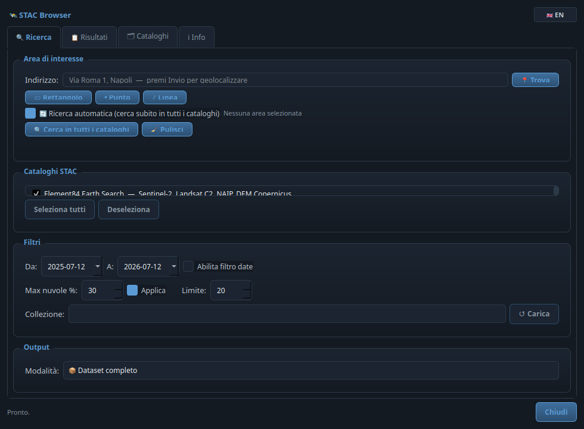
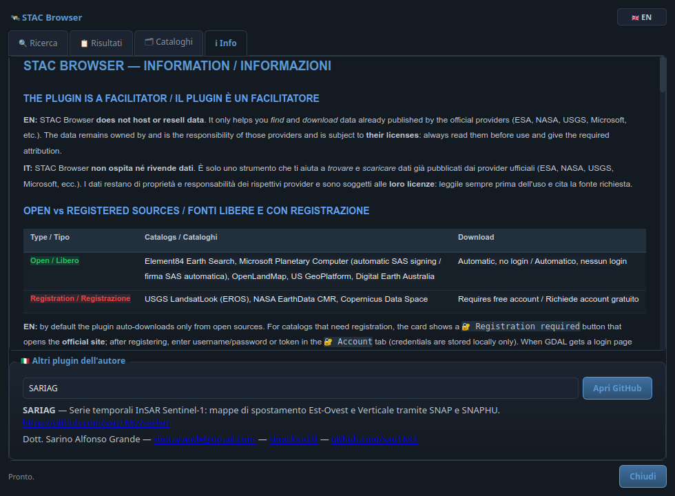

# 🛰️ STAC Browser for QGIS

[](https://qgis.org/)
[](https://www.gnu.org/licenses/old-licenses/gpl-2.0.en.html)
[](https://www.riverbankcomputing.com/software/pyqt/)
[](https://flake8.pycqa.org/)
[](https://stacspec.org/)

> **IT** · Trova dati satellitari liberi disegnando un'area (rettangolo, **punto** o **linea**) o digitando un **indirizzo**: il plugin interroga **automaticamente** tutti i cataloghi STAC e mostra **solo** i dati realmente presenti, pronti per il **download** o per l'**aggiunta diretta a QGIS**.
>
> **EN** · Find free satellite data by drawing an area (rectangle, **point** or **line**) or by typing an **address**: the plugin **automatically** queries every STAC catalog and shows **only** the data that actually exists, ready to **download** or to be **added directly to QGIS**.

**🌐 Lingua / Language:** [🇮🇹 Italiano](#-italiano) · [🇬🇧 English](#-english)

---

## 🇮🇹 Italiano

### Cos'è
**STAC Browser** è un plugin per QGIS che semplifica la ricerca, l'anteprima e il download di dati di osservazione della Terra (satellitari, DEM, dati pedologici e climatici) sfruttando lo standard aperto **SpatioTemporal Asset Catalog (STAC)**.

Invece di aprire decine di portali diversi, definisci una zona d'interesse **una sola volta** e il plugin cerca **in parallelo** in tutti i principali cataloghi mondiali, restituendoti risultati organizzati per **tipo dato**, una **timeline** delle acquisizioni, anteprime, metadati e azioni rapide.

### A cosa serve
- 🌍 **Trovare dati gratuiti** per qualsiasi area del pianeta senza conoscere in anticipo quali archivi la coprono.
- 🛰️ **Confrontare** rapidamente scene Sentinel, Landsat, MODIS, DEM, ecc. di provenienza diversa.
- ⚡ **Caricare al volo** un raster remoto in QGIS via `/vsicurl/` (senza scaricare l'intero file) oppure salvarlo su disco.
- 🧭 Costruire flussi di lavoro GIS partendo da un indirizzo, un punto sul campo o un tracciato.

### ✨ Funzionalità principali
| | Funzionalità | Descrizione |
|---|---|---|
| 🔄 | **Ricerca automatica** | Una casella "Ricerca automatica": appena definisci l'area, il plugin interroga **tutti** i cataloghi e mostra **solo i record presenti**, senza che tu debba specificare nulla. |
| ▭ | **Disegno rettangolo** | Selezione classica per Bounding Box. |
| • | **Disegno punto** | Clicca un punto: la ricerca avviene in una piccola area attorno ad esso. |
| ╱ | **Disegno linea** | Traccia una polilinea (es. un percorso): si cerca lungo il suo inviluppo. |
| 📍 | **Geocoding indirizzo** | Digita un indirizzo o un toponimo: **Nominatim** (OpenStreetMap) lo converte in coordinate e la mappa si centra automaticamente. |
| 🖼️ | **Anteprime e metadati** | Thumbnail, data, copertura nuvolosa, piattaforma, GSD, banda, livello di processamento. |
| 🧭 | **Timeline risultati** | Ogni catalogo mostra una timeline cliccabile delle acquisizioni, collegata ai dettagli del dataset. |
| 🗂️ | **Gruppi per tipo dato** | I risultati sono divisi in ortofoto, 1/2/3 bande, multispettrale, DEM, radar e altri dati. |
| ↔️ | **Griglia adattiva** | Le schede dei risultati si ridispongono in 1-4 colonne in base alla larghezza della finestra. |
| 🎚️ | **Scelta bande COG** | Prima del download puoi scegliere tutte le bande disponibili o solo alcune; il salvataggio locale mostra logo, percentuale e tempo. |
| 🧪 | **Indici COG opt-in** | Quando le bande sono disponibili, abilita un flag esplicito e salva **NDVI**, **NDWI** o **Falso Colore** come GeoTIFF locale, con tempo di download/elaborazione visibile. |
| ⬇️ | **Download / Add to QGIS** | Scarica l'asset su disco **oppure** aggiungilo come layer raster remoto. |
| ✂️ | **Ritaglio automatico** | Ritaglia al confine comunale (OSM/Nominatim) o alla geometria attiva, oppure scarica il dataset completo. |
| 🔐 | **Cataloghi liberi / con login** | Tab Cataloghi in due sotto-schede, con licenza, sito ufficiale e campi utente/password/token/API. |
| 🌐 | **Bilingue** | Interfaccia IT/EN commutabile in un clic. |
| 🎨 | **Tema scuro "slate blue"** | Interfaccia scura condivisa della famiglia SinoCloud, compatibile **PyQt5 (QGIS 3)** e **PyQt6 (QGIS 4)**. |

### 🗂️ Cataloghi inclusi
| Catalogo | Dati principali | Licenza |
|---|---|---|
| **Element84 Earth Search** | Sentinel-2 L2A, Landsat C2, NAIP, Copernicus DEM | CC BY 4.0 / Public Domain |
| **Microsoft Planetary Computer** | Sentinel, Landsat, MODIS, NAIP, DEM, permafrost… | Dipende dalla collezione |
| **USGS LandsatLook** | Landsat Collection 2 (5/7/8/9) | Public Domain |
| **NASA EarthData CMR** | MODIS, VIIRS, ASTER, OCO-2… | Public Domain (login per alcuni) |
| **OpenLandMap** | Suolo, vegetazione, clima globale | CC BY 4.0 |
| **US GeoPlatform** | Dataset geospaziali federali USA | Public Domain |
| **Copernicus Data Space** | Sentinel-1/2/3/5P | CC BY 4.0 (login per il download) |
| **Digital Earth Australia** | Landsat/Sentinel elaborati su Australia | CC BY 4.0 |

### 🛠️ Installazione
1. Scarica la release `.zip` oppure clona questo repository.
2. In QGIS: **Plugin ▸ Gestisci ed installa plugin… ▸ Installa da ZIP**.
3. Seleziona l'archivio e premi **Installa Plugin**.

> Il plugin compare nella barra strumenti e nel menù **GeoFusion Tools**.

### 🚀 Utilizzo rapido
1. Apri **STAC Browser** dalla toolbar.
2. Definisci l'area in **uno** di questi modi:
   - digita un **indirizzo** e premi Invio (📍 Trova), oppure
   - clicca **▭ Rettangolo**, **• Punto** o **╱ Linea** e disegna sulla mappa.
3. Con **🔄 Ricerca automatica** attiva (default) i risultati compaiono da soli.
   In alternativa, disattivala per scegliere cataloghi/collezioni/date/nuvolosità e premere **🔍 Cerca**.
4. Nei risultati usa la **timeline** o le schede per aprire i dettagli; **🧪 Indici** abilita NDVI/NDWI/Falso Colore solo se lo STAC espone le bande necessarie.
5. Per le bande COG, scegli **tutte** o solo quelle necessarie e salvale localmente prima del caricamento in QGIS.
6. Per gli indici, attiva il flag di conferma e salva il GeoTIFF locale prima del caricamento in QGIS.
7. Usa **➕ QGIS** per caricare il layer, **💾 Scarica** per salvarlo.

### ⚠️ Attribuzione richiesta
- **Sentinel:** *"Contains modified Copernicus Sentinel data [anno] / ESA"*
- **Landsat:** *"Courtesy of the U.S. Geological Survey"*
- **OpenLandMap:** *"© OpenLandMap contributors, CC BY 4.0"*
- **DEA:** *"© Commonwealth of Australia (Geoscience Australia), CC BY 4.0"*

---

## 🇬🇧 English

### What it is
**STAC Browser** is a QGIS plugin that streamlines the discovery, preview and download of Earth-observation data (satellite imagery, DEMs, soil and climate data) through the open **SpatioTemporal Asset Catalog (STAC)** standard.

Instead of opening a dozen different portals, you define your area of interest **once** and the plugin searches **in parallel** across the world's main catalogs, returning results grouped by **data type**, an acquisition **timeline**, previews, metadata and quick actions.

### What it is for
- 🌍 **Find free data** for any area on Earth without knowing in advance which archives cover it.
- 🛰️ **Compare** Sentinel, Landsat, MODIS, DEM and more from different providers at a glance.
- ⚡ **Load remote rasters on the fly** into QGIS via `/vsicurl/` (no full download) or save them to disk.
- 🧭 Build GIS workflows starting from an address, a field point or a track.

### ✨ Key features
| | Feature | Description |
|---|---|---|
| 🔄 | **Automatic search** | An "Automatic search" box: as soon as you define the area, the plugin queries **all** catalogs and shows **only the records that exist**, with nothing for you to specify. |
| ▭ | **Rectangle drawing** | Classic bounding-box selection. |
| • | **Point drawing** | Click a point: the search runs over a small area around it. |
| ╱ | **Line drawing** | Trace a polyline (e.g. a route): the search uses its envelope. |
| 📍 | **Address geocoding** | Type an address or place name: **Nominatim** (OpenStreetMap) converts it to coordinates and the map auto-centers. |
| 🖼️ | **Previews & metadata** | Thumbnail, date, cloud cover, platform, GSD, bands, processing level. |
| 🧭 | **Results timeline** | Each catalog shows a clickable acquisition timeline linked to dataset details. |
| 🗂️ | **Data-type groups** | Results are split into orthophoto, 1/2/3 bands, multispectral, DEM, radar and other data. |
| ↔️ | **Adaptive grid** | Result cards reflow into 1-4 columns according to the available window width. |
| 🎚️ | **COG band selection** | Before download you can choose all available bands or only some; local save shows logo, percentage and time. |
| 🧪 | **Opt-in COG indices** | When the required bands exist, enable an explicit flag and save **NDVI**, **NDWI** or **False Color** as a local GeoTIFF with visible download/processing time. |
| ⬇️ | **Download / Add to QGIS** | Download the asset to disk **or** add it as a remote raster layer. |
| ✂️ | **Automatic clip** | Clip to a municipal boundary (OSM/Nominatim) or the active geometry, or download the full dataset. |
| 🔐 | **Open / login catalogs** | Catalogs tab with two sub-tabs, showing license, official site and username/password/token/API fields. |
| 🌐 | **Bilingual** | One-click IT/EN interface. |
| 🎨 | **"Slate blue" dark theme** | Shared SinoCloud-family dark UI, compatible with **PyQt5 (QGIS 3)** and **PyQt6 (QGIS 4)**. |

### 🗂️ Included catalogs
| Catalog | Main data | License |
|---|---|---|
| **Element84 Earth Search** | Sentinel-2 L2A, Landsat C2, NAIP, Copernicus DEM | CC BY 4.0 / Public Domain |
| **Microsoft Planetary Computer** | Sentinel, Landsat, MODIS, NAIP, DEM, permafrost… | Collection-dependent |
| **USGS LandsatLook** | Landsat Collection 2 (5/7/8/9) | Public Domain |
| **NASA EarthData CMR** | MODIS, VIIRS, ASTER, OCO-2… | Public Domain (login for some) |
| **OpenLandMap** | Soil, vegetation, global climate | CC BY 4.0 |
| **US GeoPlatform** | US federal geospatial datasets | Public Domain |
| **Copernicus Data Space** | Sentinel-1/2/3/5P | CC BY 4.0 (login for download) |
| **Digital Earth Australia** | Landsat/Sentinel processed over Australia | CC BY 4.0 |

### 🛠️ Installation
1. Download the `.zip` release or clone this repository.
2. In QGIS: **Plugins ▸ Manage and Install Plugins… ▸ Install from ZIP**.
3. Select the archive and click **Install Plugin**.

> The plugin appears in the toolbar and under the **GeoFusion Tools** menu.

### 🚀 Quick start
1. Open **STAC Browser** from the toolbar.
2. Define the area in **one** of these ways:
   - type an **address** and press Enter (📍 Locate), or
   - click **▭ Rectangle**, **• Point** or **╱ Line** and draw on the map.
3. With **🔄 Automatic search** on (default) results appear by themselves.
   Otherwise, turn it off to pick catalogs/collections/dates/cloud cover and press **🔍 Search**.
4. In the results, use the **timeline** or cards to open details; **🧪 Indices** enables NDVI/NDWI/False Color only when the STAC item exposes the required bands.
5. For COG bands, choose **all** or only the needed bands and save them locally before loading into QGIS.
6. For indices, enable the confirmation flag and save the local GeoTIFF before loading it into QGIS.
7. Use **➕ QGIS** to load the layer, **💾 Download** to save it.

### ⚠️ Required attribution
- **Sentinel:** *"Contains modified Copernicus Sentinel data [year] / ESA"*
- **Landsat:** *"Courtesy of the U.S. Geological Survey"*
- **OpenLandMap:** *"© OpenLandMap contributors, CC BY 4.0"*
- **DEA:** *"© Commonwealth of Australia (Geoscience Australia), CC BY 4.0"*

---

## ⚖️ Fonti, licenze e account / Sources, licenses and accounts

> **IT** · STAC Browser è **solo un facilitatore di download**: non ospita né rivende dati. I dati restano dei rispettivi provider (ESA, NASA, USGS, Microsoft…) e sono soggetti alle **loro licenze** — leggile e cita la fonte richiesta.
>
> **EN** · STAC Browser is **only a download facilitator**: it does not host or resell data. Data belongs to its providers (ESA, NASA, USGS, Microsoft…) and is subject to **their licenses** — read them and give the required attribution.

| | Fonti / Sources | Download |
|---|---|---|
| 🟢 **Libere / Open** | Element84 Earth Search, Microsoft Planetary Computer *(firma SAS automatica / automatic SAS signing)*, OpenLandMap, US GeoPlatform, Digital Earth Australia | Automatico, nessun login / Automatic, no login |
| 🟡 **Con registrazione / Registered** | USGS LandsatLook (EROS), NASA EarthData CMR, Copernicus Data Space | Account gratuito / Free account |

**IT** · Di default il plugin scarica **solo dalle fonti libere**. Il tab **🗂 Cataloghi** elenca tutti gli STAC in **due sotto-schede** — *🟢 Liberi* e *🔐 Con autenticazione* — con, per ciascuno, **licenza** (e link), **sito ufficiale** e (per i secondi) i campi **utente / password / token / API key**. Sulla scheda dei risultati i cataloghi con login mostrano **🔐 Registrazione richiesta** che apre il **sito ufficiale**; dopo la registrazione inserisci le credenziali (salvate solo in locale). Se il server restituisce una pagina di login al posto del file, il plugin **non salva file fasulli** e te lo segnala.

**EN** · By default the plugin downloads **only from open sources**. The **🗂 Catalogs** tab lists every STAC in **two sub-tabs** — *🟢 Open* and *🔐 With authentication* — each showing its **license** (with link), **official site** and (for the latter) **username / password / token / API key** fields. In the results, login-only catalogs show **🔐 Registration required** opening the **official site**; after registering, enter your credentials (stored locally only). If the server returns a login page instead of the file, the plugin **never saves bogus files** and warns you.

## ✂️ Ritaglio / Clipping

> **IT** · Nel tab **🔍 Ricerca**, gruppo **Output**, scegli **📦 Dataset completo** o **✂️ Ritaglio automatico**. Il confine di ritaglio può essere il **limite comunale OSM** (digiti il nome del comune; la geometria arriva da OpenStreetMap via Nominatim) oppure la **geometria del layer/selezione attiva** in QGIS. Il ritaglio legge il COG remoto via GDAL `/vsicurl/`, scaricando **solo i pixel** dell'area scelta. Durante l'elaborazione appare un **popup con il logo del plugin che lampeggia** sempre più forte verso il completamento.
>
> **EN** · In the **🔍 Search** tab, **Output** group, pick **📦 Full dataset** or **✂️ Automatic clip**. The clip boundary can be the **OSM municipal boundary** (type the municipality name; geometry from OpenStreetMap via Nominatim) or the **geometry of the active QGIS layer/selection**. Clipping reads the remote COG through GDAL `/vsicurl/`, fetching **only the pixels** inside the chosen area. A **popup with the pulsing plugin logo** (blinking harder toward the end) shows progress.

## 🧩 How it works / Come funziona

```
            Rectangle ▭      Point •      Line ╱       Address 📍 (Nominatim)
                 │             │            │                   │
                 └─────────────┴─────► EPSG:4326 bbox ◄─────────┘
                                          │
                          (Automatic search ─ all catalogs in parallel, QThread)
                                          │
        ┌──────────┬──────────┬──────────┬──────────┬──────────┬──────────┐
   Earth Search  MS PC   LandsatLook  NASA CMR  OpenLandMap  …  DEA
        └──────────┴──────────┴──────────┴──────────┴──────────┴──────────┘
                                          │
                       Only catalogs/records that return data
                                          │
                       Results grid ──► ➕ Add to QGIS (/vsicurl/)  |  💾 Download
```

Any drawing mode or the geocoder is normalized to an **EPSG:4326 bounding box**, so the search logic is uniform regardless of how the area was defined.

## 📁 Project structure / Struttura del progetto
| File | Role |
|---|---|
| `plugin.py` | Entry point, toolbar action, map-tool activation. |
| `dialog.py` | Main dialog (Search / Results / Info tabs), workers, item cards. |
| `core_stac.py` | STAC search, item parsing, Nominatim geocoding, layer loading, download. |
| `map_tool.py` | `DrawBboxTool`, `DrawPointTool`, `DrawLineTool`. |
| `qt_compat.py` | PyQt5/PyQt6 enum compatibility shim. |
| `tests/` | Pure-Python unit tests (no QGIS, no network). |

## 🧪 Development / Sviluppo
```bash
# Lint (configuration in setup.cfg, max-line-length = 100)
flake8 .

# Unit tests (no QGIS required)
python -m unittest discover -s tests -v
```
Il codice è verificato con **flake8** (0 warning) e coperto da test unitari per il parsing STAC, il rilevamento dei raster e il geocoding Nominatim. / The code passes **flake8** (0 warnings) and is covered by unit tests for STAC parsing, raster detection and Nominatim geocoding.

## ❓ FAQ
**IT — Perché alcuni cataloghi non mostrano risultati?** Non tutti gli archivi coprono ogni area del mondo; in modalità automatica quelli senza dati vengono semplicemente nascosti.
**EN — Why do some catalogs show no results?** Not every archive covers every area; in automatic mode catalogs without data are simply hidden.

**IT — Il download chiede un login.** Alcuni dataset (Copernicus, parte di NASA) richiedono una registrazione gratuita presso il provider.
**EN — A download asks for a login.** Some datasets (Copernicus, part of NASA) require a free account with the provider.

## 📸 Screenshot

| Scheda Ricerca / Search tab | Scheda Info con menù a tendina / Info tab with drop-down |
|---|---|
|  |  |

> **IT** · A sinistra la scheda di ricerca (area, indirizzo, cataloghi); a destra la scheda Info con il menù a tendina degli altri plugin dell'autore. · **EN** · On the left the search tab (area, address, catalogs); on the right the Info tab with the drop-down of the author's other plugins.

## 👤 Autore / Author
Sviluppato da / Developed by **Dott. Sarino Alfonso Grande**.
- ✉️ **Email:** [sino.grande@gmail.com](mailto:sino.grande@gmail.com)
- 🌐 **Sito ufficiale / Official website:** [sinocloud.it](https://sinocloud.it)
- 🐙 **GitHub:** [sag1687](https://github.com/sag1687)

### Altri plugin dell'autore / Other plugins by the author
| Plugin | Repository |
|---|---|
| **SARIAG** | [github.com/sag1687/sariag](https://github.com/sag1687/sariag) |
| **GeoBridge** | [github.com/sag1687/geobridge](https://github.com/sag1687/geobridge) |
| **Quick CRS Fixer** | [github.com/sag1687/CRS_FIXER](https://github.com/sag1687/CRS_FIXER) |
| **GeoCSV Mapper** | [github.com/sag1687/GeoCSV-Mapper](https://github.com/sag1687/GeoCSV-Mapper) |
| **Q-Press** | [github.com/sag1687/q_press](https://github.com/sag1687/q_press) |
| **QGIS Ledger** | [github.com/sag1687/qgis_ledger](https://github.com/sag1687/qgis_ledger) |
| **TAF Italia** | [github.com/sag1687/TAF_ITALIA_DOWNLOAD](https://github.com/sag1687/TAF_ITALIA_DOWNLOAD) |

## 📜 Licenza / License
**GPL-2.0** — Copyright © 2026 Dott. Sarino Alfonso Grande.
Questo plugin è software libero, ridistribuibile secondo i termini della GNU GPL v2. / This plugin is free software, redistributable under the terms of the GNU GPL v2.

---
*Progettato con il tema scuro "slate blue" condiviso della famiglia di plugin SinoCloud e compatibilità estesa Qt5/Qt6 (QGIS 3 e QGIS 4). / Designed with the shared "slate blue" dark theme of the SinoCloud plugin family and extended Qt5/Qt6 (QGIS 3 and QGIS 4) compatibility.*
